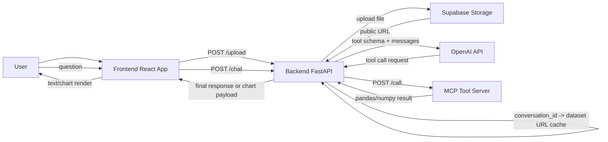

# Data Analyst Agent

An AI-powered data analysis workspace that combines:

- A React frontend for dataset upload, local EDA previews, and chat/chart interaction.
- A FastAPI backend that orchestrates conversations and OpenAI tool-calling.
- An MCP-style tool server (FastAPI) that executes dataset operations (querying, profiling, insights, charts).

The project is designed so the model answers by calling deterministic data tools instead of hallucinating metrics.

## System Architecture

### High-Level Components

1. Frontend (React + TypeScript + Chart.js)
- File upload UX (.csv/.xlsx/.xls).
- Local parsing and instant EDA summary (preview table, missing values, histogram, correlation heatmap).
- Chat UI for natural-language analysis requests.
- Renders backend-generated chart payloads.

2. API Backend (FastAPI)
- Exposes `/upload` and `/chat` endpoints.
- Stores uploaded datasets in Supabase Storage.
- Keeps a conversation-scoped mapping between `conversation_id` and dataset public URL.
- Runs the LLM agent loop and mediates MCP tool calls.

3. MCP Tool Server (FastAPI)
- Exposes `/tools` (tool schema) and `/call` (execute tool).
- Hosts pandas/numpy-based data tools:
	- `describe_dataset`
	- `query_dataset`
	- `generate_chart`
	- `detect_outliers`
	- `compute_correlation`
	- `generate_insights`
- Caches datasets by URL to reduce repeated reads.

4. External Services
- OpenAI Chat Completions API for tool-calling orchestration.
- Supabase Storage for uploaded dataset persistence and public URL access.

### Runtime Interaction



## AI Implemented Concepts

### 1. Tool-Augmented LLM Agent
- The backend agent uses OpenAI tool-calling with explicit function schemas from the MCP server.
- A system prompt enforces behavior: rely on tools, avoid inventing values, and inspect dataset structure first.
- The loop runs multiple reasoning/tool rounds (up to 4) before returning a final answer.

### 2. Function Calling as Control Plane
- The model does not directly process raw files; it calls explicit operations over structured arguments.
- Tool specs act as contracts, constraining operations to valid analytical intents.

### 3. Multi-Turn Conversation Memory
- Conversations are tracked by `conversation_id`.
- Message history is preserved per conversation so the agent can handle follow-up questions with context.

### 4. Dual Intelligence Path (Backend + Local Fallback)
- Primary mode: backend LLM + MCP tools.
- Fallback mode: frontend local EDA heuristics can still produce basic analytical responses when backend calls fail.

### 5. Structured Chart Generation
- Visualization requests are represented as structured chart payloads (`type`, `labels`, `datasets`) rather than plain text.
- The frontend renders these via Chart.js with chart-type-aware normalization/validation.

## Data Engineering Practices

### Dataset Lifecycle and Access Pattern
- Upload once through `/upload`.
- Persist file in Supabase Storage.
- Resolve dataset via URL during tool execution.
- Cache loaded DataFrames in the MCP server (`DATASET_CACHE`) keyed by URL to limit repeated I/O.

### Data Profiling and Quality Signals
- Automatic profiling includes row/column shape, data types, missing values, and correlations.
- Additional quality/insight functions:
	- Outlier detection (z-score)
	- Correlation analysis (pearson/spearman/kendall)
	- Rule-based insights (missingness, dominance, skewness, strong correlations)

### Defensive Data Handling
- Column existence checks in query operations.
- Numeric-type validation before statistical operations.
- JSON-safety normalization of numpy/pandas types before API return.
- Non-JSON response handling and error-wrapping in backend MCP client.

### Reproducible Aggregation/Query Semantics
- `query_dataset` uses explicit parameters (`groupby`, `aggregations`, `filters`, `sort_by`, `limit`) instead of free-form SQL.
- This keeps operations auditable and deterministic.

## Agent Structure and Pipeline

### A. Dataset Ingestion Pipeline

1. User uploads dataset from frontend.
2. Frontend parses file locally (`xlsx` parser) and computes immediate EDA summary for instant UX.
3. Frontend sends file to backend `/upload` with a generated `conversation_id`.
4. Backend stores file in Supabase and saves public URL in conversation cache.
5. Backend clears in-memory conversation history to start fresh with the uploaded dataset context.

### B. Question Answering Pipeline

1. User sends natural-language question from chat.
2. Backend retrieves dataset URL using `conversation_id`.
3. Agent builds prompt + conversation history + tool definitions.
4. OpenAI model decides whether to call one or more tools.
5. Backend executes tool calls through MCP `/call`, injecting dataset URL.
6. Tool results are appended back as `tool` messages.
7. Agent returns:
	 - Text answer (`type: text`), or
	 - Chart payload (`type: chart`) for frontend rendering.

### C. Core Agent Loop Characteristics

- Iterative reasoning with bounded tool rounds (up to 4).
- Special chart handling path for immediate visualization response.
- Minimal-tool-use principle instructed by system prompt.
- Error-aware MCP invocation (timeouts, non-JSON responses, missing result keys).

## Project Structure

```text
backend/
	app/
		main.py          # API endpoints (/upload, /chat)
		agent.py         # LLM tool-calling orchestration loop
		mcp_client.py    # MCP tool listing/calling client
		utils.py         # dataset URL cache and upload-time profiling
	config.py

mcp_client/
	server.py          # MCP-like tool server
	tool_specs.py      # function schemas for OpenAI tools
	tool_registry.py   # name -> function registry
	tools.py           # analytical operations over pandas
	utils.py           # dataset cache + base profiling

frontend/
	src/components/Dashboard.tsx  # upload, local EDA, chat, charts
```

## AI Estimation Usage

Estimated AI-generated contribution in this project: 75% to 80%.

## Configuration

Backend environment variables:

- `OPENAI_API_KEY`
- `SUPABASE_URL`
- `SUPABASE_KEY`
- `MCP_URL` (default: `http://localhost:8001`)
- `FRONT_URL` (default: `http://localhost:5173`)

## Current Scope and Notes

- Supported input files: `.csv`, `.xlsx`, `.xls`.
- Chat visualization currently supports bar, scatter, line, pie/doughnut, and histogram-style outputs.
- Conversation state and dataset URL mapping are in-memory caches; use external persistence for production-grade durability.